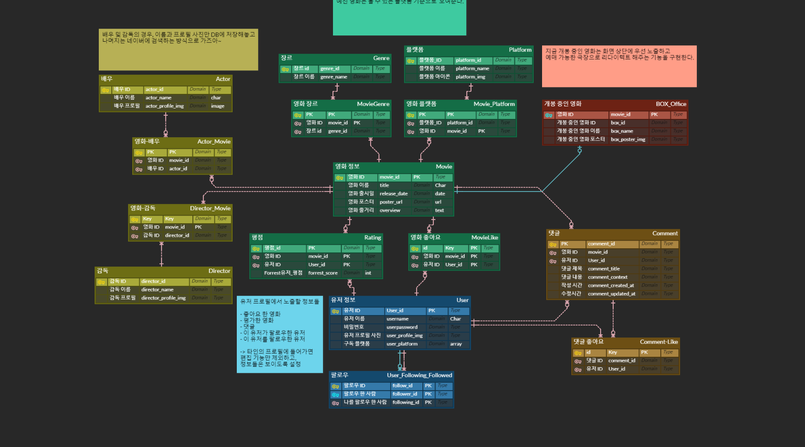

# READ.ME

## 0. Get Started

```
$ git clone https://github.com/SSAFY-REVIEWED/REVIEWED-CLIENT.git
```

### - Front -

```
# 필요한 파일을 NPM으로 설치하기
npm i

# 서버 켜기
npm run serve
```

### - Back -

```
# 기본 설치 과정
python -m venv venv
source venv/Sacript/activate
pip install -r requirements.txt
python manage.py makemigrartions
python manage.py migrate

# 저장된 데이터 불러오기
python manage.py loaddata movies/fixtures/*

# 서버 켜기
python manage.py runserver
```

## 1. 서비스 컨셉

일상에 지친 당신. 휴식이 필요하지 않나요?

당신의 휴식을 위한 공간. **For rest** 입니다.

당신이 찾아 간 숲 속에 있던 멋있던 광경처럼, 당신 만을 위한 숲을 제공하겠습니다. 

## 2. 기획

### < 업무 분장 >

- 프론트 앤드 및 총괄: 강정훈
    - 백앤드 및 프론트 앤드 기술 자문
    - 페이지 구상
    - VUE 컴포넌트 기반 기술 구현
        - 홈 화면
        - 디테일 화면
        - 프로필 페이지
        - 검색 창
    - CSS를 통한 웹 디자인
    - 백앤드 ↔ 프론트 앤드 데이터 연결 작업
- 백앤드: 강환석
    - 기본 백앤드 로직 작성
    - 게시글 CRUD
    - DB 모델링
    - 검색 및 파싱, DB 갱신 알고리즘

### < 기획안 >

1. 컨셉:  힐링을 위한 영화 공간
2. 구현 예정 기능:
    - 각 영화별 지원되는 OTT 반환
    - 맞춤형 힐링 영화 추천
    - 영화 별 댓글 및 좋아요 기능
    - 유저간 팔로잉 팔로우 기능
    - 영화 추천 알고리즘
        - 장르, 평점 기반 + 사용자의 ‘좋아요’ 가중치 반영
        - → 시간이 허용하면, K-means 기반 영화 추천 알고리즘 직접 작성 예정
3. 기획 ERD
    

    

## 3. 개발 결과

### < 기획안 과의 차이점 >

### i. 설계도의 차이

- 기본의 ERD를 수정하여, 쓰지 않은 파트를 날렸다.
    - 수정된 ERD
        

        

### < 기능 부문 >

### i. 영화 데이터

- 테마인 휴식에 맞게, DB에 부하를 최소화 하고자, 기본적으로 들고 있는 데이터가 적다.
- 하지만, 이러한 데이터들을 때와 경우에 맞게 가져오는 것이 핵심 기술이라고 할 수 있다.
- 사용자의 검색과 매 순간의 박스 오피스를 기반으로 영화 데이터가 쌓이고, 추천 받는다.
    

    
- 기본 JSON 파일로 999개의 파일은 제공

### ii. 영화 추천 알고리즘

- **for rest** 에서는 사용자의 검색에 따라 DB가 조정됩니다.
- 먼저 For rest 접속 시, 현재 상영 중인 영화의 데이터를 DB로 받아옵니다.
    

    
- 이에 더하여 특정 검색어를 통해 데이터를 받으면, 해당 데이터를 DB에 넣습니다.
- 이렇게 쌓인 DB에서, 인기도 및 평점을 기반으로 상위의 영화들을 추천 목록으로 제작,
이를 시작화면에 노출 시킵니다.
    

    

### iii. API

### TMDB

> 공통 URL: https://api.themoviedb.org
> 
1. 검색 API
    - 추가 URL: [/3/search/movie?api_key=](https://api.themoviedb.org/3/search/movie?api_key=f555794485796214438961ced766522e&language=ko-KR&query=%7Bword%7D&page=1&include_adult=true)[{API_KEY}](https://api.themoviedb.org/3/movie/now_playing?api_key=%7BTMDB_API_KEY%7D&language=ko-KR&page=%7Bi%7D)
    - 활용:
        - 검색을 통해 유저의 관심사 캐치 및 관심 분야 영화를 DB에 저장
2. 영화 상세 검색 API
    - 추가 URL: [/3/movie/{movie['id']}?api_key=](https://api.themoviedb.org/3/movie/{movie['id']}?api_key=f555794485796214438961ced766522e&language=ko-KR)[{API_KEY}](https://api.themoviedb.org/3/movie/now_playing?api_key=%7BTMDB_API_KEY%7D&language=ko-KR&page=%7Bi%7D)
    - 활용:
        - 각 검색 결과의 영화 ID를 기반으로 영화 별 상세 정보를 검색하여 DB에 저장
3. 현재 상영 중인 영화 정보 API
    - 추가 URL: [/3/movie/now_playing?api_key={API_KEY}](https://api.themoviedb.org/3/movie/now_playing?api_key=%7BTMDB_API_KEY%7D&language=ko-KR&page=%7Bi%7D)
    - 활용:
        - 현재 상영 중인 영화를 각 박스 오피스 랭크 별로 상단에 노출 시킴.
        - 이렇게 상단에 노출된 영화들은 일단 DB에 반영된다.
        - 초안에서는 각 영화 별 극장 예매 리다이렉트까지 고려함.
4. 이미지 URL
    - 기본 URL: [https://image.tmdb.org/t/p/w500/](https://image.tmdb.org/t/p/w500/)
        - 추가 예시 URL: /d9C2H1qoFt9AL4DwRlqEEZK4hVa.jpg
        - 포스터나 스틸샷을 가져오는 용도

### iv. 커뮤니티

1. 사용자 ←→ 사용자
    - 상호 팔로우/팔로잉
        - 상대의 페이지로 들어가서, 상대방의 취향과 작성 글을 조회 가능
            

            
2. 사용자 → 영화 페이지
    

    
    - 영화 좋아요 기능
        - 같은 영화에 여러 유저의 추천 여부를 반영 가능
        

        
3. 사용자 ←→ 영화 페이지 ←→ 사용자
    - 영화 댓글 & 영화 댓글에 대한 좋아요
        - 여러 유저들의 소통과 공감의 장 형성

### 

## 5. Feed-Back

### < 한계점 >

1. 시간 관리 실패
    - 백앤드 부분이 늦어지면서, 전체적인 일정에 차질이 있었다.
    - 업무 분장의 세분화에 실패하여, 시간을 온전히 사용하지 못했다.
    - 타임 테이블 관리가 미흡하여 제대로 지켜지지 못했다.
2. 당초 계획했던 기능들의 상당수를 구현하지 못했다.
    - 셀레늄, K-means처럼, 처음에 준비해놓고도 제대로 활용하지 못한 툴들이 많이 있다.
    - 시간 적인 여유가 없었음과 더불어, 구상한 로직들을 제대로 구현하지 못했다.
